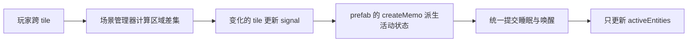

# 按 tile 管理场景实体生命周期

本文记录后续实施方案：每个 tile 持有一个活动状态 signal，玩家跨 tile 时由场景管理器更新变化的 tile，prefab 用 `createMemo` 派生自身的活动状态。当前 [stafflight.ts](../packages/prefab/src/stafflight.ts) 仍逐帧检查距离，[ProximityEntities](../packages/prefab/src/proximityEntities.ts) 仍遍历实体检查距离；本文中的统一 tile 管理器、响应式接入和调度接口尚未实现。

开发约束见 [AGENTS.md](../AGENTS.md)，响应式原语见 [packages/signals](../packages/signals/README.md)，存档与渲染规则见 [存档系统](dst-save-system.md)、[billboard 绘制](dst-billboard-rendering.md)。

## tile 与状态来源

活动网格复用 [tile.ts](../packages/prefab/src/tile.ts) 的 `TILE_SIZE = 12`。以实体实际地面脚点计算有符号坐标，与 `TurfMap` 和存档地皮坐标一致：

```ts
const col = Math.floor(position.x / TILE_SIZE);
const row = Math.floor(position.z / TILE_SIZE);
const tileKey = `${col},${row}`;
```

例如 `x = -0.1` 属于 `col = -1`，`x = 12` 属于 `col = 1`。活动索引采用有符号坐标；`TileMap.worldToTile()` 的地图中心偏移属于地皮数组索引，两者转换时需要显式处理。跳跃高度、sprite 中心和包围盒不参与 tile 归属。

每个登记的 tile 创建一次 `Signal<boolean>`：`true` 表示 active，`false` 表示 inactive。同一 tile 内的所有 prefab 共用该 signal；同一 key 在存活期间始终对应同一个 signal 对象。场景管理器拥有写权限，prefab 接收 `ReadonlySignal<boolean>`，只读取活动状态。地皮类型和活动状态分别存储；踩踏、挖地或改变地皮类型不会替换活动 signal。

目标数据结构示意：

```ts
interface ActivityTile {
  key: string;
  active: Signal<boolean>;
  entities: Set<EntityId>;
}

tiles: Map<TileKey, ActivityTile>;
activeTiles: Set<TileKey>;
activeEntities: Set<EntityId>;
entities: Map<EntityId, LogicalEntity>;
```

tile 可以按需登记，避免为整张空地图预先创建 signal。管理器保留活动区域的 key 集合；新登记 tile 的 signal 根据当前区域初始化，不能一律初始化为 inactive。空的 inactive tile 只有在实体迁出且所有订阅释放后才可回收。

## 玩家跨 tile 时发布变化

每帧只计算一次玩家所在 tile。玩家仍在同一 tile 时，活动区域不重算，也不重复写入 tile signal。首次启动、玩家跨 tile、传送、活动半径调整或玩家加入／离开时，重新计算区域并更新差集：

1. 计算新的 active tile 集合。
2. 对离开区域的 tile 执行 `active.set(false)`。
3. 对进入区域的 tile 执行 `active.set(true)`。
4. 保持交集内的 signal 不变，再统一处理 prefab 状态切换。

活动范围以整块 tile 为单位，属于粗粒度可见／更新区域，不再保证原先逐实体的精确圆形距离边界。范围规则由管理器统一配置，例如以 `max(abs(col - playerCol), abs(row - playerRow)) <= R` 定义方形区域。可采用进入半径 `R`、保留半径 `R + 1`：外圈只保留已激活 tile，超过外圈才卸载，减少玩家在边界往返时的资源抖动。具体半径是实施配置，不视为原版 DST 的引擎参数。

多人场景使用所有玩家活动区域的并集；一个玩家离开后，仍被其他玩家覆盖的 tile 保持 active。传送直接计算新旧集合差集，无需依次经过中间 tile。

### 从玩家 tile 开始螺旋遍历与短路

活动区域从玩家当前所在 tile 开始，按方形螺旋逐圈向外枚举：第 0 圈只有玩家 tile，第 `r` 圈包含 `max(abs(deltaCol), abs(deltaRow)) == r` 的边界 tile，每个 tile 只访问一次。同一圈内采用固定方向与起点，保证遍历和资源加载顺序稳定；负坐标沿用前述有符号 tile 坐标。

对进入半径 `R`、保留半径 `R + 1` 的方形区域，枚举第 0 圈到第 `R + 1` 圈后立即停止，不继续搜索更远 tile。内圈纳入新的活动集合，保留圈只纳入此前已经 active 的 tile。`spiralRing()` 是拟新增的逐圈枚举器，以下示意只计算区域，不直接加载资源或写 signal：

```ts
const nextActive = new Set<TileKey>();
const retainRadius = enterRadius + 1;

for (let ring = 0; ring <= retainRadius; ring++) {
  for (const tile of spiralRing(playerTile, ring)) {
    if (!isWithinMap(tile)) continue;
    const key = tileKey(tile);
    if (ring <= enterRadius || previousActive.has(key)) {
      nextActive.add(key);
    }
  }
}
```

`previousActive` 是本次更新前的活动集合快照；多人时先为各玩家计算候选集合并取并集，最后统一发布差集。区域中的空 tile 仍可保留 key，使随后生成的 prefab 能正确初始化活动 signal，不需要为每个空 key 创建 tile 对象或 signal。

短路必须建立在“所有后续圈都无法满足活动／保留范围”的条件上。遇到 inactive、未登记、没有实体或越过地图边界的单个 tile 时，只跳过该 tile，不能结束整条螺旋；同圈或后续圈可能仍存在范围内的有效 tile。普通方形螺旋只保证圈半径递增，不保证欧氏距离逐点递增。例如圆形半径为 1 格时，`(1, 1)` 在圆外，但同圈的 `(0, 1)` 仍在圆内；改用圆形范围时，需要根据剩余整圈的距离下界判断能否结束，不能在第一个圆外 tile 处 `break`。

结束新区域枚举后，仍要处理 `previousActive - nextActive` 中的全部 tile，保证旧区域外的实体及时卸载。尤其是传送时，旧活动区域可能完全不在本次螺旋搜索范围内；卸载差集不能依赖新区域的枚举路径。

新增 tile 的唤醒／加载队列沿用从玩家 tile 向外的螺旋圈顺序，同圈按固定顺序处理，使近处区域优先准备。圈顺序表示 tile 网格距离优先，不保证同圈实体的精确欧氏距离顺序。需要限制单帧模型创建量时，可以在达到时间或数量预算后暂缓加载队列，下一帧继续；活动区域与 signal 差集仍完整计算、统一提交，尚未准备好的实体保持在活动更新集合之外。玩家再次跨 tile 后，队列重新校验目标区域及请求代次，取消已失效的任务。

螺旋遍历的作用是限定搜索范围、明确停止条件并安排加载优先级。完整枚举半径内方形区域仍是 `O(R²)`；主要性能收益来自局部 tile 索引与仅更新活动实体。玩家只移动一个相邻 tile 时，后续还可按新增／离开的边缘增量更新区域，减少重复枚举交集。



## prefab 用 createMemo 派生状态

prefab 的 `awake` 是所属 tile 活动状态的派生值，实际模型是否存在是资源状态，两者分别维护。memo 只计算状态；加载、卸载、计时补算和音效播放由生命周期处理函数执行。

以下示意使用现有 signal 读取形式；`activity.queueTransition()` 和 `tileRegistry.get()` 是拟新增的管理器接口：

```ts
// 固定实体可以直接闭包读取 tile.active.get()。
// 移动实体用 signal 保存所属 tile 的只读活动 signal。
const tileActivity = createSignal<ReadonlySignal<boolean>>(
  readonlySignal(tileRegistry.get(position).active),
);

const awake = createMemo(() => tileActivity.get().get());

const stopWatching = createEffect(() => {
  activity.queueTransition(entityId, awake() === true);
});
```

`awake()` 读取缓存的派生值。同一个 tile 状态变化时，该 tile 内 prefab 的 memo 才重新计算；玩家在 tile 内移动不会触发它们。prefab 跨 tile 时，迁移实体索引并用 `tileActivity.set(nextTile.active)` 切换依赖，memo 重新追踪新 tile。`.get()` 用于收集依赖，`.peek()` 不会建立 memo 的依赖。

移动实体的归属变更由移动／传送提交路径负责，创建、掉落、拾取、永久移除也必须登记或注销索引。即使玩家没有跨 tile，实体跨 tile 仍会更新自己的绑定；无需重新发布未变化的 tile 活动 signal。

同为 active 的两个 tile 之间迁移时，`awake` 仍为 `true`，不重复创建模型或音源。两个 inactive tile 之间迁移只更新逻辑位置与归属；active 与 inactive 之间迁移才触发加载或卸载。

### 现有 createMemo 的实施前提

[signal.ts](../packages/signals/src/signal.ts) 当前的 `createMemo` 用内部 `createEffect` 计算缓存，依赖变化在微任务中处理。因此 `tile.active.set(false)` 后立即读取 `awake()`，可能仍读到旧值；同一个任务内的多次修改也会合并。不能假设 tile 的同步 `subscribe()` 与 memo 的更新时间相同。

实施时需要建立明确的帧阶段：更新游戏时钟及位置 → 发布 tile 变化 → 完成 memo／effect 更新 → 提交生命周期转换 → 更新活动实体 → 渲染。响应式调度器需要提供可控的刷新阶段，或提供等价的同步派生值机制；仅添加一个 transition 队列，不能解决 memo 尚未更新的问题。`queueTransition()` 按实体合并同一提交阶段的最终活动状态，并先处理卸载，再处理加载。保存、停止游戏和场景退出也需要处理或取消待提交转换。

当前 `createMemo` 只返回 getter，未暴露内部 effect 的释放函数。仅调用示例中的 `stopWatching()`，不会解除 memo 对 tile 的订阅。实施前必须补齐 memo 的可释放所有权，例如可释放的 memo accessor 或响应式 scope，确保永久移除 prefab 时清理内部依赖与排队任务。本文不把 `memo.dispose()` 或刷新接口描述为现有 API。

## active 与 inactive 的生命周期

逻辑实体保存稳定的 ID、prefab ID、地面位置、皮肤与组件状态。模型、动画控制器、音源属于可卸载资源。`activeEntities` 只包含完成唤醒的有效实体；每帧更新与 billboard 排序只遍历这个集合，避免对 inactive 实体继续进行距离检查或动画更新。

| 转换／事件 | 处理顺序 |
| --- | --- |
| 首次在 active tile 创建 | 登记逻辑状态，准备资源，创建模型并加入活动集合；普通生成可播放源 prefab 的出现动作 |
| 首次在 inactive tile 创建／恢复 | 登记逻辑状态和时间基准，绑定 tile signal，暂不创建独立模型与音源 |
| active → inactive | 结算尾帧，记录已结算时间，移出活动集合与场景，停止并断开音源，释放独立模型资源 |
| inactive → active | 补算游戏时间，检查是否过期／失效；仍有效才原地创建模型、恢复组件外观与音源，再加入活动集合 |
| 永久移除 | 注销 tile 与实体索引，释放模型和音源，取消待提交转换／资源请求，释放 effect 与 memo 的依赖 |
| 场景退出 | 停止更新，取消待提交转换与加载，移除所有实体订阅，释放管理器拥有的共享资源 |

重新激活已有实体恢复待机或对应组件状态，不重播首次生成的出现动画／音效。恢复后实体 ID、位置、皮肤及组件身份保持一致。加载失败时保留可重试的逻辑实体，尚未准备好的模型不加入活动更新集合。

动画实体使用现有 sprite factory：卸载通过 `disposeSprite()` 释放该实体的几何体，同类实体共享的纹理和材质由 factory 管理，场景退出时统一释放。声音继续使用 [sound.ts](../packages/prefab/src/sound.ts) 的 `PreloadSounds`、`PlaySound` 和 `DisposeSounds`；每个活动实体有独立音源。活动范围、渲染层级和绘制顺序遵循现有 billboard 规则，重建后仍以逻辑实体的地面脚点排序。

异步准备资源时，为实体保存加载代次或取消标记。完成后重新检查实体仍存在、仍需要 active 资源且请求代次有效，再绑定模型；已卸载或永久移除的实体不能因旧请求完成而复活。准备完成时按当前游戏时间补算，避免加载耗时延长寿命。过期实体直接清除，不短暂创建模型、灯光或音源。

inactive 逻辑实体仍参与存档及需要完整世界状态的查询，例如建筑阻挡、地面占用或实体身份查找。可见实体集合不能替代这些查询的权威来源。

## 每 60 帧结算与休眠补算

场景管理器维护由有效游戏 `dt` 推进的共享时钟。inactive tile 不需要自己的逐帧时钟；prefab 保留最近一次结算时的游戏时间，唤醒时用共享时钟的差值补算。游戏暂停、停止或无效时间步不推进时钟，也不消耗生命周期。

以 `stafflight`／`staffcoldlight` 为例：

1. active 时累计有效游戏帧数与实际 `dt`，每 60 帧结算一次剩余寿命；附近动画和光照脉动继续逐帧更新。
2. tile 变为 inactive 时结算不足 60 帧的部分，更新 `lastSettlementSeconds`，然后卸载资源。
3. inactive 时保留逻辑状态与订阅，暂停独立模型工作，不逐帧扣减寿命。
4. tile 再次 active 时计算 `elapsed = gameTime - lastSettlementSeconds`，一次扣减所有未结算时间。过期的移除，未过期的恢复并开始新的 60 帧批次。

发生转换的时间步只能结算一次；同一帧唤醒补算后，活动更新不能再次扣减已经计入的 `dt`。正常到期的星体保留源 Lua 的消失动作与清理流程；休眠期间已过期的星体在补算后直接移除。

tile 的 inactive 状态暂停逐帧工作，具体组件决定休眠期间如何推进领域状态。星体寿命等计时状态继续按游戏时间流逝；需要暂停的行为记录暂停状态。食物、燃料及其他组件仍遵循各自的领域规则和转移／停止前结算要求，不能仅因为同处一个 tile 而统一冻结所有时间。

## 保存与恢复

`c_save()` 从全部逻辑实体导出数据，包括 inactive tile 内的实体。导出前完成待提交的活动转换，并结算所有未结算时间，过期实体不进入存档。保存稳定的 ID、位置、皮肤、数量与组件状态；tile signal、memo、活动集合和模型引用属于运行时状态，不写入存档。

恢复时先建立逻辑实体及 tile 索引，根据恢复后的玩家位置初始化 active tile signal，再为 prefab 建立 memo 和生命周期监听。active tile 中的有效实体准备并加载模型，inactive tile 中的实体保留逻辑状态。计时基准以恢复后的游戏时钟和已保存的剩余时间建立，避免重复扣减存档前已经结算的时间；恢复不重播首次生成音效。

本方案不新增调试命令或 prefab／item ID，`c_spawn`、`c_give`、`c_save` 的现有参数与支持范围继续由 [README](../README.md#调试命令debugcommand) 和共享 prefab 定义说明。

## 验证范围

实施时保持代表性覆盖：

- 同 tile 内移动不发布活动变化；跨 tile、负坐标边界和传送正确更新差集，同一 tile 的多个实体共享 signal，缓冲圈保留已有活动状态。
- 螺旋从玩家 tile 开始、逐圈无重复，在保留范围结束后短路；空 tile、单个圆外 tile 或地图边界不提前终止遍历，传送后旧区域仍完整卸载，加载队列按圈优先且取消失效任务。
- active → inactive 释放独立资源，inactive → active 补算并在原位置重建；已过期实体不加载，实体跨 tile 后解除旧依赖，永久移除后旧 signal 或异步请求不会重建实体。
- 保存覆盖活动与休眠实体，结算尾帧及休眠时间；恢复保留身份、位置、组件状态，共享纹理不因单个实体卸载而释放。

tile 差集、计时与订阅规则用单元测试验证；浏览器保留少量实际 WebGL／音频、输入及完整保存流程。性能验证分别观察每帧活动实体数、跨 tile 的生命周期转换数量及模型创建／释放次数，不以是否使用 memo 作为性能结论。
